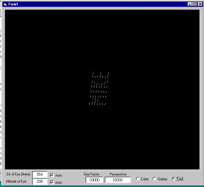



## plot 3d points on a 2d plane

### Description

Want to plot 3d points on the screen? this code will enable you to do this! I did not write the original code that calculates the x,y co'ord from x,y,z co'ordinates, but I compiled it into an easy to use (cut 'n paste) form and added a few examples of what you can do. lines wouldn't be a problem either, just write a wrapper function to do the job! Please vote! (I didn't do the trig, but hey, it's just math ;-) and I did the rest!)
 
### More Info
 

             |
---                |---
**Submitted On**   |2003-02-19 08:10:02
**By**             |[Fosters](https://github.com/Planet-Source-Code/PSCIndex/blob/master/ByAuthor/fosters.md)
**Level**          |Intermediate
**User Rating**    |4.7 (28 globes from 6 users)
**Compatibility**  |VB 4\.0 \(32\-bit\), VB 5\.0, VB 6\.0
**Category**       |[Graphics](https://github.com/Planet-Source-Code/PSCIndex/blob/master/ByCategory/graphics__1-46.md)
**World**          |[Visual Basic](https://github.com/Planet-Source-Code/PSCIndex/blob/master/ByWorld/visual-basic.md)
**Archive File**   |[plot\_3d\_po1546832192003\.zip](https://github.com/Planet-Source-Code/fosters-plot-3d-points-on-a-2d-plane__1-43342/archive/master.zip)

